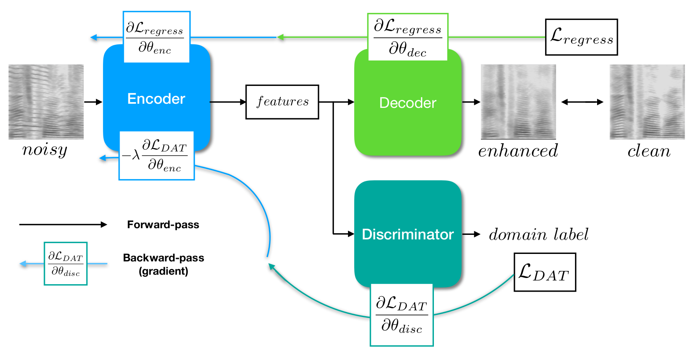

# Noise Adaptive Speech Enhancement using Domain Adversarial Training (Interspeech 2019)

### Introduction
This is the original Tensorflow implementation for our [paper](https://arxiv.org/abs/1807.07501).

### Dependencies
* Python 3.6
* TensorFlow 1.6
* librosa 0.6.0

### Steps and Usages
1. Data Preprocess:
  - Prepare noisy wavs directory, e.g. "TrNoisy/.../.../..."
    - Prepare clean wavs directory, e.g. "TIMIT/Clean/Train/..."
    - Make noisy wav list, e.g. tr_noisy_list.txt 
<pre><code>TrNoisy/cafeteria_babble/12dB/FDHC0_SI1559.wav
TrNoisy/cafeteria_babble/12dB/FDHC0_SI2189.wav
...</code></pre>

2. Train the whole network:
  - Check parameters in hyperparameters.py
    - sample_rate
    - fft points, hop length, window length
  - Check log directory and ckpt name
  - Make TFrecords for faster data loading:
    - Run:
<pre><code>python main.py --mode train  --model_type adap --ckpt_name temp_exp --write_tfrecord true --train_noisy_list  tr_noisy_list.txt --train_clean_path TIMIT/Clean/Train/ </code></pre>
 - For baseline model or  upperbound model, change - -model_type to "base" or  "upper"
 
3. Inference:
    - Prepare testing noisy wav list, e.g. ts_noisy_list.txt 
    - Run:
<pre><code>python main.py --mode test --test_noisy_list ts_noisy_list.txt --test_iter 100000</code></pre>

### Citation

If you find the code useful in your research, please cite:
    
@article{liao2018noise,
  title={Noise adaptive speech enhancement using domain adversarial training},
  author={Liao, Chien-Feng and Tsao, Yu and Lee, Hung-Yi and Wang, Hsin-Min},
  journal={arXiv preprint arXiv:1807.07501},
  year={2018}
}
    
### Contact

e-mail: jerrygood0703@gmail.com.tw
